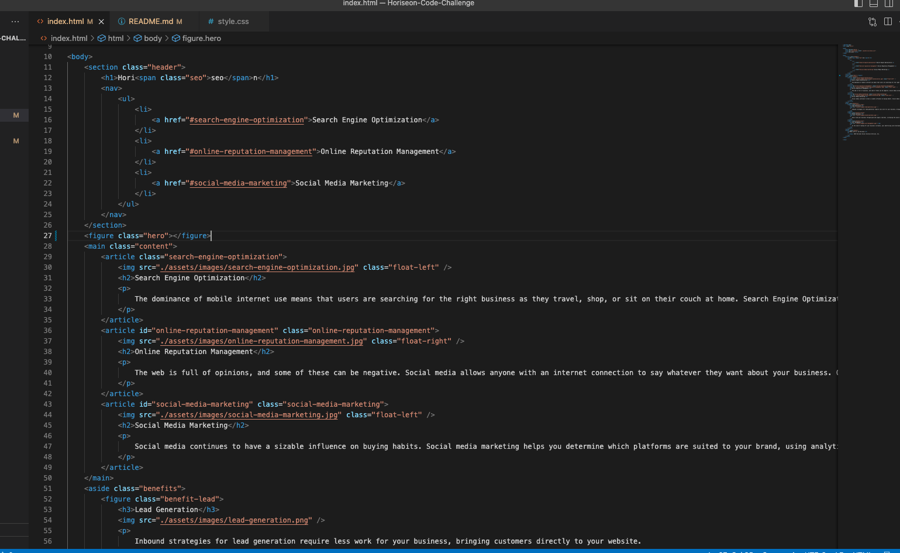

# Horiseon-Code-Challenge

## Description

The goal of this challenge was to refactor an already existing starter code, changing the overwhelming amount of "div" elements to more easily identifiable semantic elements. The end result is a more organized html document that gives the viewer a better idea of what sections of code directly affect corresponding sections within the webpage. The project shows the interchangeability of div/semantic elements along with giving a better idea of how to better organize my own html documents as I continue to work in the future.

## Installation

N/A

## Usage

## Credits

N/A

## License

Refer to license in repository. (MIT License)

---
